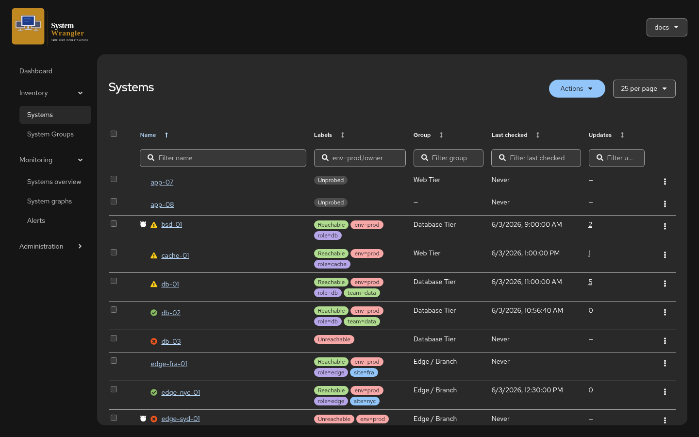
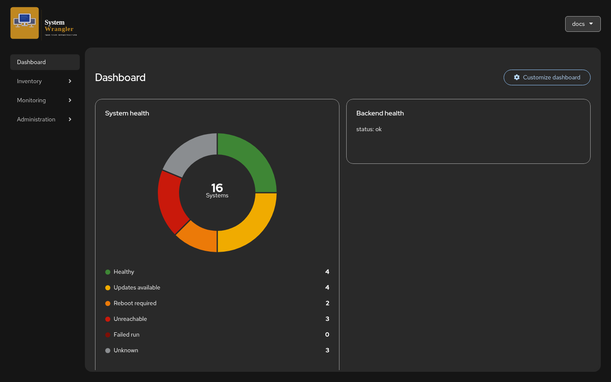
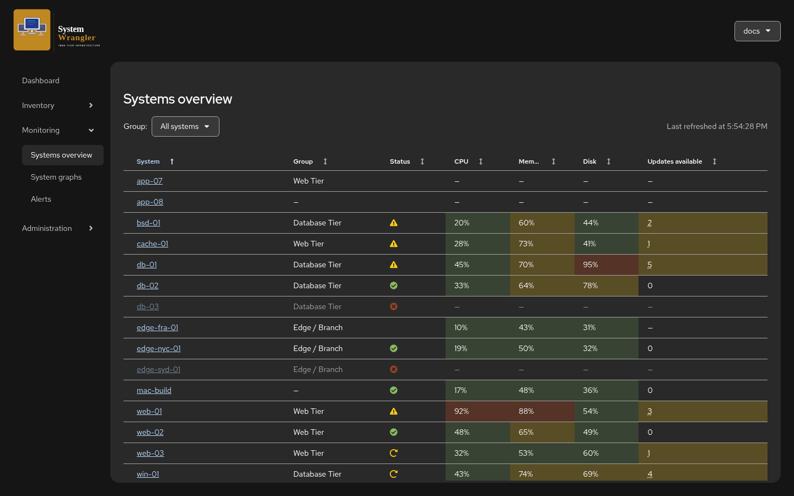
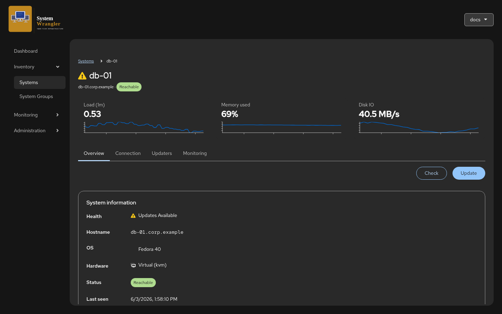
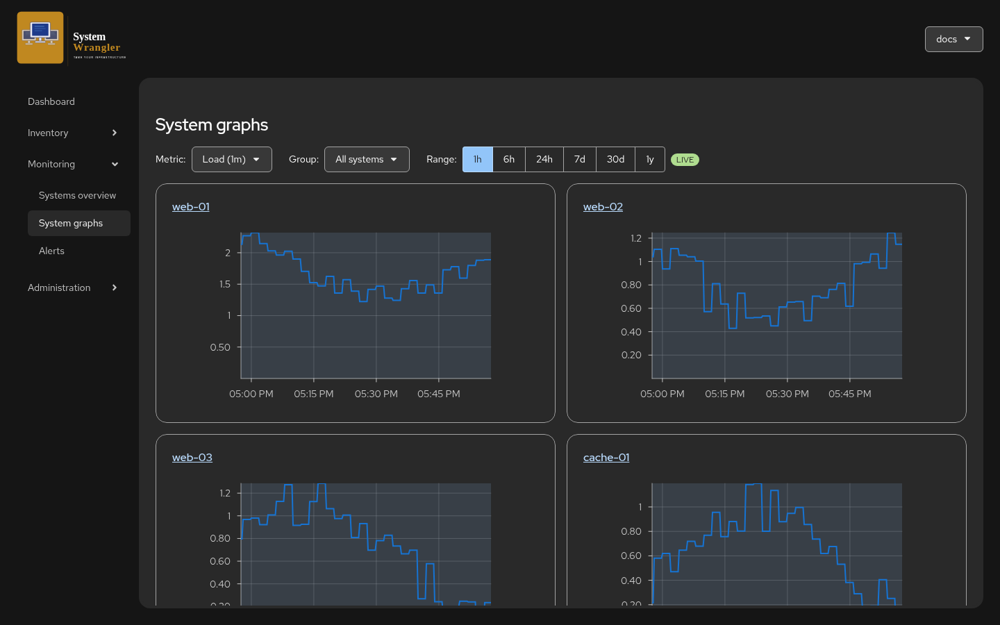
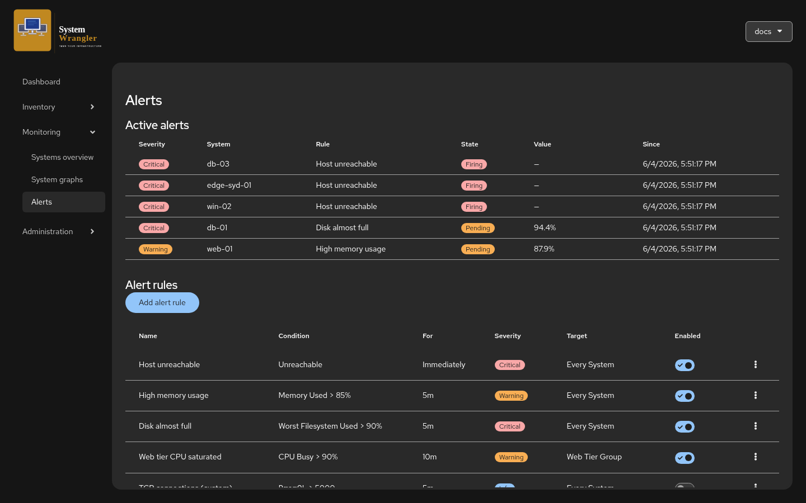
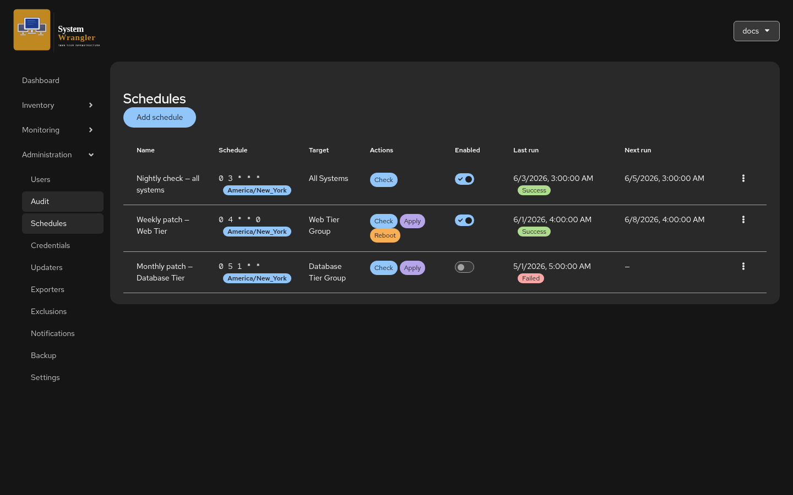

<!-- SPDX-License-Identifier: Apache-2.0 -->

# System Wrangler

**One dashboard for the state of every system you run — and for acting when
something needs attention.** System Wrangler keeps a live inventory of your
Linux, macOS, Windows, and BSD hosts, tracks pending package updates across two
dozen package managers, watches reachability and telemetry, and turns all of it
into alerts, scheduled patch runs, and notifications.

It ships as a **single container**: a Go server with the web UI embedded in the
binary, backed by SQLite. There is no separate app server, database, or job
queue to operate.



---

## Highlights

- **Cross-platform updates.** Built-in support for ~20 package managers — `apt`,
  `dnf`, `apk`, `pacman`, `zypper`, `xbps`, `eopkg`, `flatpak`, `snap`, `brew`,
  `mas`, `softwareupdate`, `winget`, `choco`, `scoop`, `pkg`, `pkg_add`, `pkgin`,
  `syspatch`, `fwupdmgr`, and more. Check for pending updates and apply them on
  demand or on a schedule. Define your own custom updaters when you need one.
- **Live telemetry.** Per-system graphs (CPU, memory, disk, network, load,
  uptime, …) and a cross-system overview with heat-mapped CPU/memory/disk, all
  driven by a Prometheus you point it at. Real PromQL, no proprietary metric
  store.
- **A dashboard you arrange.** Compose your landing page from widgets — a
  system-health donut, cross-system trend cards, and "top talker" leaderboards
  (busiest CPU, fullest disks) — and rearrange them to match how you work.
- **Alerts that fit how you work.** Rules on reachability, curated metric
  thresholds, or raw PromQL — at a severity you choose, optionally requiring the
  condition to hold *for* a duration before firing, scoped to every system, a
  group, or a label selector.
- **Notifications you control.** Webhook, email, and Slack channels with
  per-rule routing and a severity / quiet-hours delivery policy. Every user can
  also wire up their own personal channels, subscriptions, and quiet schedule.
- **Scheduling.** Cron-based check / apply / reboot runs against any target,
  with run history.
- **Organize at scale.** Groups, `key=value` labels, and powerful filtering
  across the inventory. Package exclusions at global, group, or system scope.
- **Built for teams.** Role-based access control (admin / operator / auditor),
  applied globally or per group, with a complete audit log of who did what.
- **Secure by default.** Local accounts (bcrypt + signed session cookies) with
  an optional OIDC add-on; secrets sealed at rest with AES-256-GCM; built-in
  backup/restore.

## Screenshots

| Dashboard | Systems overview |
|---|---|
|  |  |

| System detail | Per-system graphs |
|---|---|
|  |  |

| Alerts | Scheduled patch runs |
|---|---|
|  |  |

More walkthroughs, with screenshots for each area, are in the
**[User Guide](docs/user-guide.md)**.

## Quick start

System Wrangler runs as a container, published at
`quay.io/jasonmontleon/system-wrangler:latest`.

```sh
# Generate a master key (base64 of 32 random bytes) used to seal secrets at rest.
head -c 32 /dev/urandom | base64 > master.key

# Run it (the image is pulled automatically).
podman run -d --name system-wrangler \
  -p 8080:8080 \
  -v "$PWD/data":/var/lib/system-wrangler \
  -v "$PWD/master.key":/etc/system-wrangler/master.key:ro \
  -e SW_MASTER_KEY_FILE=/etc/system-wrangler/master.key \
  quay.io/jasonmontleon/system-wrangler:latest
```

Open <http://localhost:8080>. On first launch you'll be prompted to **create the
initial administrator account**; after that you sign in normally.

The telemetry pages need a Prometheus. The repo ships a ready-made stack in
[`deploy/`](deploy) that runs System Wrangler and Prometheus together with
automatic exporter discovery — see
[Deploying with Prometheus](docs/installation.md#deploying-with-prometheus). If
you already run a Prometheus, point the server at it with
`-e SW_PROMETHEUS_URL=http://prometheus.internal:9090` instead.

See the **[Installation guide](docs/installation.md)** for the compose stack,
TLS, OIDC, backups, and key rotation.

## Documentation

All docs live under [`docs/`](docs/):

- **[Quick start](docs/quickstart.md)** — from zero to a running instance.
- **[User guide](docs/user-guide.md)** — a tour of every area of the UI.
- **[Installation guide](docs/installation.md)** — deployment, TLS, env vars,
  backups.
- **[Architecture](docs/architecture.md)** — how the pieces fit together.
- **[API reference](docs/api-reference.md)** — the HTTP API.
- **[Development guide](docs/development.md)** — building and contributing.
- **[Troubleshooting](docs/troubleshooting.md)** — common issues and fixes.

## How it works

System Wrangler is a single Go binary that **embeds the built React/PatternFly
SPA** and serves it alongside a JSON API. State lives in **SQLite**. It reaches
out to your hosts over **SSH/Ansible** to run update checks and applies, and
reads telemetry from a **Prometheus** (bundled in the `deploy/` stack, or your
own). Reachability probing, alert evaluation, scheduled runs, and notification
delivery all run as background loops inside the one process.

It is **single-tenant by design** — to isolate environments, run a second
container. There is no external message broker, cache, or app server to manage.

## Tech stack

- **Backend:** Go (standard library first; SQLite for storage).
- **Frontend:** React 19 + TypeScript + PatternFly v6, built with Vite and
  embedded into the Go binary at build time.
- **Runtime deps:** SSH + Ansible (bundled in the image) for host actions;
  Prometheus for metrics.

## License

[Apache-2.0](LICENSE).
