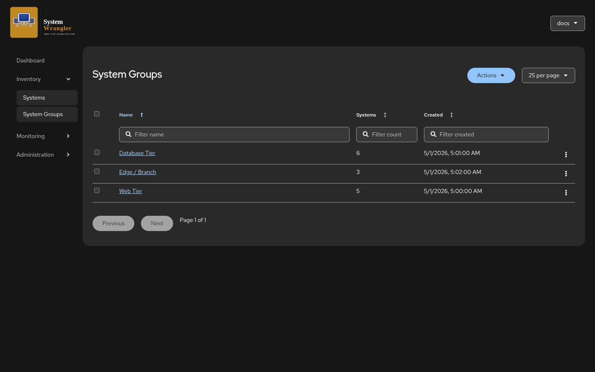
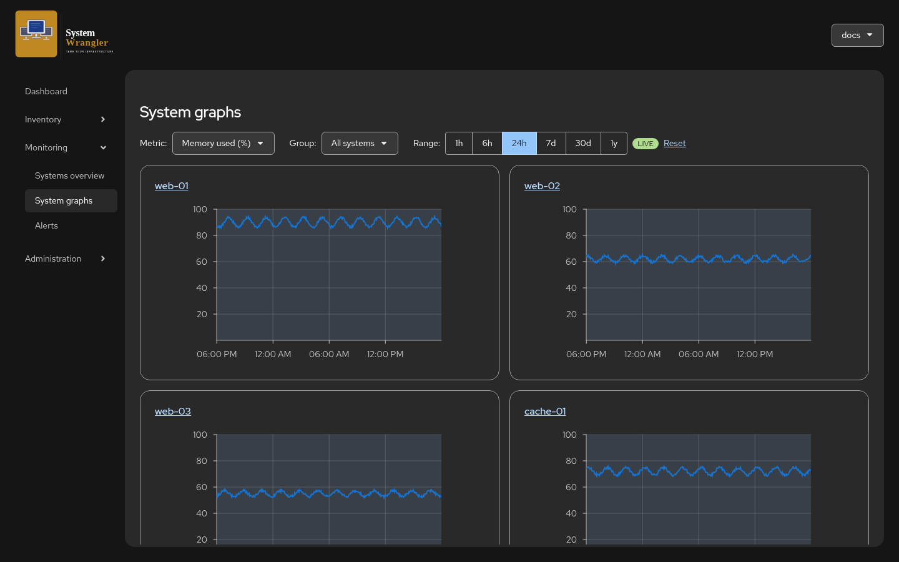
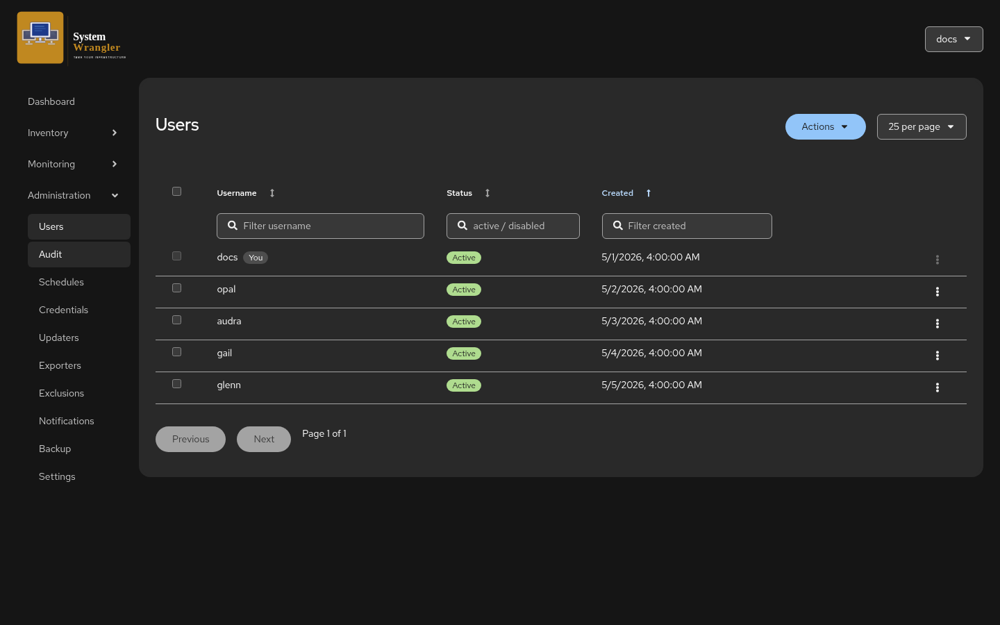
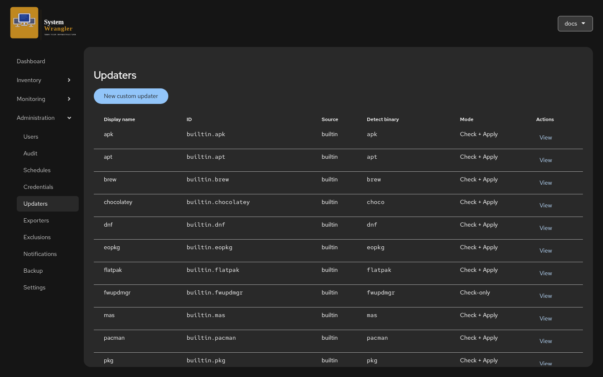
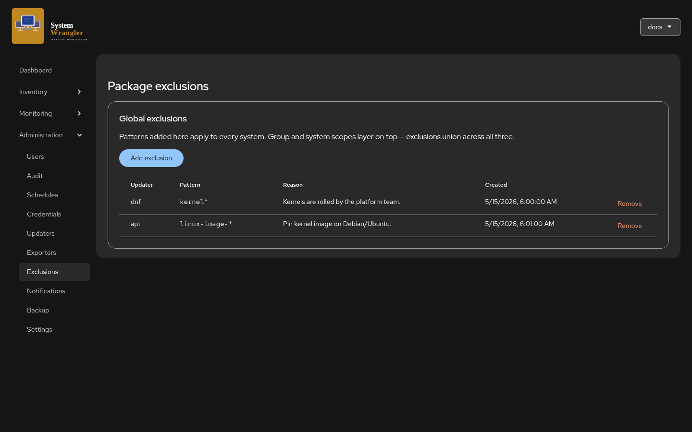
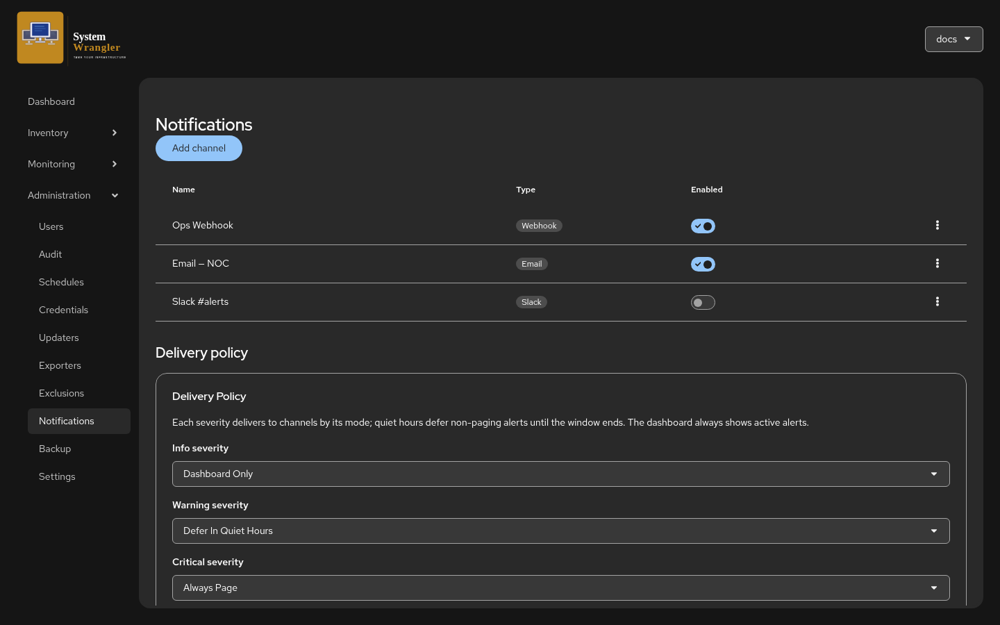
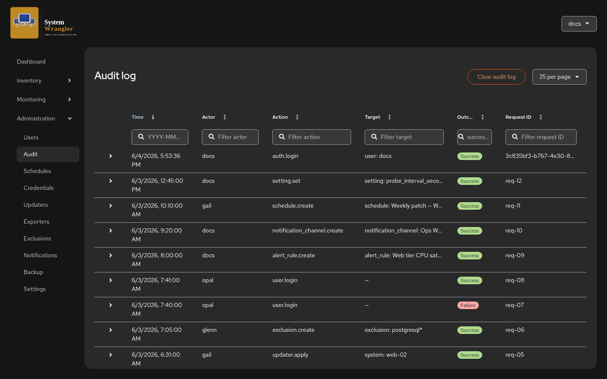
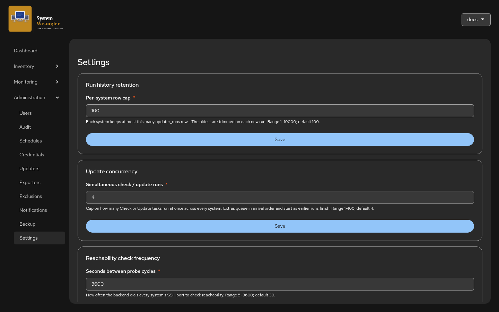
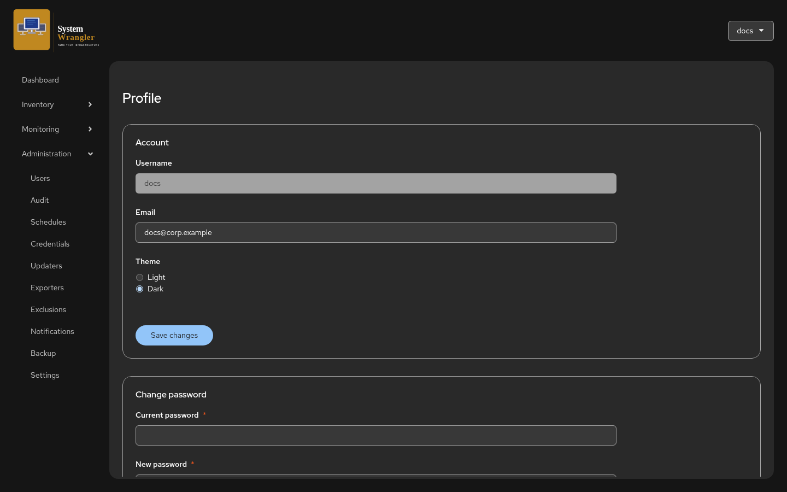

<!-- SPDX-License-Identifier: Apache-2.0 -->

# User Guide

This guide walks through System Wrangler the way you'll use it — area by area,
following the left-hand navigation: **Dashboard**, **Inventory**,
**Monitoring**, and **Administration**, plus your personal **Profile**.

> The screenshots use a small demo dataset so each page has something to show.
> Your own data will differ, but every control is in the same place.

## Contents

- [Signing in](#signing-in)
- [The Dashboard](#the-dashboard)
- [Inventory](#inventory)
  - [Systems](#systems)
  - [A system in detail](#a-system-in-detail)
  - [System Groups](#system-groups)
- [Monitoring](#monitoring)
  - [Systems overview](#systems-overview)
  - [System graphs](#system-graphs)
  - [Alerts](#alerts)
- [Administration](#administration)
  - [Users & roles](#users--roles)
  - [Schedules](#schedules)
  - [Updaters](#updaters)
  - [Package exclusions](#package-exclusions)
  - [Notifications](#notifications)
  - [Audit log](#audit-log)
  - [Settings](#settings)
- [Your profile](#your-profile)

---

## Signing in

The first time System Wrangler starts with an empty database, it asks you to
create the initial administrator account. After that, you sign in with a
username and password. Sessions are kept in a signed cookie; sign out from the
user menu in the top-right at any time.

If your deployment uses OIDC, you'll also see a single-sign-on option — see the
[Installation guide](installation.md).

## The Dashboard

The Dashboard is your landing page. Out of the box it shows a **System health**
donut — a one-glance breakdown of how many systems are healthy, have updates
available, need a reboot, are unreachable, had a failed run, or haven't been
probed yet — alongside a **Backend health** indicator.

Use **Customize dashboard** to add, remove, and rearrange widgets. Beyond the
health donut, widgets include cross-system trend cards and "top talker"
leaderboards (busiest CPU, fullest disks, and so on) that draw on the same
telemetry as the Monitoring pages.

## Inventory

Inventory is your source of truth for what you manage: the **Systems** list and
the **System Groups** that organize them.

### Systems

**Inventory → Systems** lists every system you've registered. Each row shows, at
a glance:

- A **status glyph** and, where known, a per-OS icon next to the name.
- **Labels** — the reachability state (`Reachable` / `Unreachable`) plus your own
  `key=value` tags, shown as colored chips.
- The **Group** the system belongs to.
- When it was **last checked** for updates, and how many **updates** are pending.

Every column has a filter box. Filter by name, by group, by last-checked time,
by update count, or by a **label selector** such as `env=prod` (the label filter
accepts comma-separated terms and negation). Click any column header to sort.
The status glyph summarizes a system in one mark — a green check when it's
reachable and up to date, a yellow triangle when updates are pending, a refresh
icon when a reboot is required, and a red ✗ when it can't be reached. The
**Updates** count links through to the exact packages a check found.

The **Actions** menu (and the per-row kebab) lets you run a check or apply
updates across a selection, move systems between groups, and remove systems.

### A system in detail

Click a system's name to open its detail page. The header carries the system's
status and three live **sparkline tiles** (load, memory, disk I/O); below them,
tabs organize everything else.

- **Overview** — system information (OS, hardware, hostname, last seen, when it
  was added), its **labels** (add or remove them inline), the **available
  updates** a check found, and a **recent runs** history of checks and applies.
- **Connection** — how System Wrangler reaches this host (SSH details).
- **Updaters** — which package managers are detected on this host and their
  pending packages.
- **Monitoring** — install or manage the metrics exporter for this host.

The **Check** and **Update** buttons run an update check or apply on just this
system; results land in the runs history and update the pending count.

### System Groups

**Inventory → System Groups** lists your groups with the number of systems in
each and when they were created. Groups are how you target schedules, alerts,
exclusions, and per-group roles at a slice of your estate rather than one system
at a time.

Open a group to manage its membership and its group-scoped settings.

## Monitoring

The Monitoring section turns the telemetry System Wrangler reads from Prometheus
into something you can act on: a cross-system **overview**, per-system
**graphs**, and **alerts**.

> Telemetry pages need a Prometheus that scrapes your hosts' exporters, wired up
> via `SW_PROMETHEUS_URL`. Install an exporter on a host from its **Monitoring**
> tab. Systems without telemetry simply show an empty state.

### Systems overview

**Monitoring → Systems overview** is a single table of every system with its
current **CPU**, **memory**, and **disk** alongside its status and pending
updates. The metric cells are **heat-mapped** — the busier or fuller a system
is, the warmer the cell — so the systems that need attention stand out
immediately.

Filter to a group with the selector at the top. Unreachable systems show their
last known status; systems with no telemetry show a dash.

### System graphs

**Monitoring → System graphs** shows one time-series panel per system for a
metric you pick. Choose the **metric** (CPU busy, memory used, load, network and
disk I/O, filesystem usage, TCP connections, uptime, and more), narrow to a
**group**, and pick a **range** from 1 hour to 1 year. The **LIVE** indicator
shows the data is following the current time.

A few metrics are platform-specific — load average, for example, is a
Linux/BSD concept, so Windows panels for it show "no samples" rather than
inventing a number. Switch the metric and range freely; here's memory across a
24-hour window:

### Alerts

**Monitoring → Alerts** has two parts: the **active alerts** currently firing or
pending at the top, and the **alert rules** that produce them below.

An **active alert** shows its severity, the system it's about, the rule that
matched, its state, the observed value, and how long it's been active. A rule
can require its condition to hold *for* a duration before it fires — until then
the alert is **pending**; once the duration elapses it becomes **firing**.
Reachability alerts fire immediately. Active alerts always appear here on the
dashboard, independent of whether (or how) they're also delivered to a channel.

An **alert rule** watches one of three things:

- **Reachability** — fires when a system stops answering the probe.
- **A curated metric** — memory, disk, or CPU, compared against a threshold you
  set (e.g. *Memory Used > 85%*).
- **Raw PromQL** — for anything the curated metrics don't cover.

Each rule has a **severity** (info / warning / critical), an optional **for**
duration, and a **target**: every system, a group, or a label selector. Use the
toggle to enable or disable a rule without deleting it, and **Add alert rule** to
create new ones.

## Administration

Administration holds the configuration that applies across your install: users
and roles, schedules, updater definitions, exclusions, notification channels,
the audit log, and global settings.

### Users & roles

**Administration → Users** lists the local accounts, each with its status and
when it was created (your own account is tagged **You**).

System Wrangler uses three roles — **admin**, **operator**, and **auditor** —
which you can grant **globally** or scoped to a single **group**:

- **admin** — full control (manage systems, settings, users, everything).
- **operator** — run checks, apply updates, manage day-to-day operations.
- **auditor** — read-only, including the audit log.

A global role applies everywhere; a per-group role applies only within that
group, so you can let someone operate the Web Tier without touching anything
else. Open a user to manage their roles, reset their password, or disable the
account.

### Schedules

**Administration → Schedules** automates checks and applies on a cron cadence.

Each schedule has a **cron expression** and **timezone**, a **target** (every
system, or a group), and the **actions** it runs — Check, Apply, and optionally
Reboot after applying. The list shows each schedule's last run (with success or
failure) and next run, and an **Enabled** toggle to pause it. **Add schedule**
to create a new one.

### Updaters

**Administration → Updaters** is the catalog of package managers System Wrangler
knows how to drive. The built-ins cover Linux, macOS, Windows, and BSD —
detected automatically per host by the binary they use.

Most updaters support both **Check** and **Apply**; a few are **check-only**
where applying isn't safe to automate. Use **New custom updater** to teach
System Wrangler a package manager that isn't built in by giving it a detect
binary and check/apply commands.

### Package exclusions

**Administration → Exclusions** lets you hold specific packages back from
updates by pattern. Exclusions added here are **global** — they apply to every
system.

Group- and system-scoped exclusions layer on top (set those from a group's or a
system's own page); the effective set for any system is the **union** of the
global, group, and system patterns that match it. Each exclusion records the
updater, the pattern (e.g. `kernel*`), a reason, and who created it.

### Notifications

**Administration → Notifications** configures how alerts leave the system. It
has two parts: **channels** and the **delivery policy**.

**Channels** are the destinations — **webhook**, **email**, and **Slack** — each
with an enable toggle. Add as many as you need; route individual alert rules to
specific channels from the rule itself.

The **delivery policy** decides, per **severity**, how alerts are handled:

- **Dashboard only** — show it in the app, don't send it anywhere.
- **Defer in quiet hours** — send it, but hold it until quiet hours end.
- **Always page** — send it immediately, even during quiet hours.

The dashboard always shows active alerts regardless of policy; the policy only
governs outbound delivery.

### Audit log

**Administration → Audit** is an append-only record of significant actions —
logins (successful and failed), system and configuration changes, update
applies, and more.

Each entry records the **time**, **actor**, **action**, **target**, **outcome**,
and a request ID, and expands for detail. Every column is filterable, so you can
answer "who changed this setting?" or "what did this user do?" quickly. Auditors
have read access here without any ability to change things.

### Settings

**Administration → Settings** holds the global tunables:

- **Run history retention** — how many run records each system keeps.
- **Update concurrency** — how many check/apply tasks run at once across every
  system; extras queue and start as earlier runs finish.
- **Reachability check frequency** — how often the backend probes each system's
  SSH port, plus the failure/success thresholds that decide when a system flips
  between reachable and unreachable.

There are further settings for alert evaluation cadence and notification
behavior; each field explains its range and default inline.

## Your profile

Open **Profile** from the user menu (top-right) to manage your own account.

Here you can change your **email**, switch between the **light and dark**
themes, and **change your password**. Further down, the **personal
notifications** section lets you wire up your *own* channels (separate from the
shared ones an admin configures), subscribe to the alerts you care about — by
group and severity — and set your *own* quiet-hours schedule, so you're paged on
your terms without affecting anyone else.

---

Looking for how to deploy or operate System Wrangler rather than use it? See the
[Installation guide](installation.md) and the [Architecture](architecture.md)
overview.
